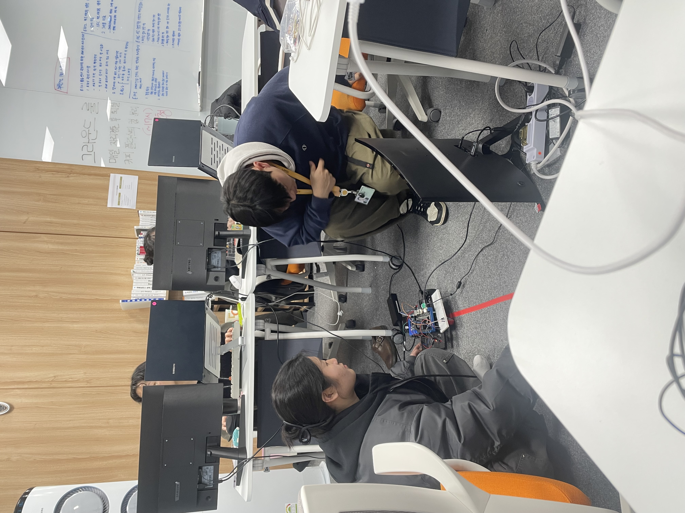

# 2025-02-12
1. 직선 주행 테스트
-> 현재위치를 mqtt로 전송하면서 라인트래킹까지 통합
-> 동시에 작동이 잘 안됨 테스트 중.



# 2025-02-11
1. 가속도계 센서 젯슨 나노 오린으로 이동
2. 라인트래킹과 현재위치 동시 통합
```
1. 8,0에서 시작할때 qr을 찍었을 때 직진
2. 100cm 이동 후부터 속도가 8로 느려지면서 qr 인식할 때까지 라인트래킹하고 qr인식되면 정지해서 명령 기다림
3. 빨간색 라인트래킹하는데 지금은 빨간색 라인이 중심에 있지않을 경우 지금은 한쪽바퀴가 거의 멈추고 다른 쪽바퀴로 중심을 찾는데, 양쪽바퀴 진행방향은 똑같고 속도를 조금 다르게 해서 급격하게 변하지않고 중심을 찾을 수 있도록 함.
4. 지금 가속도계 측정은 좌표랑 속도만 나오는데, 이동거리가 100cm가 됐을 때 2번이 실행되도록.
```

# 2025-02-10
1. 돌발상황 감지 -> 정지 후 시뮬레이터로 경고 신호 보내기 (anomaly_ultra.py)
2. 카메라 테스트 및 라인트래킹 코드 수정 (ing)

# 2025-02-07
1. Arducam mini 2MP(B0067) 젯슨 나노와 호환안됨
    -> usb 웹캠으로 연결
    -> 새로운 웹캠 주문
2. 초음파센서를 통해 돌발상황 감지하여 즉각 정지 -> 젯슨에 연결하는게 맞을듯 -> 파이로 변경안하는걸로.

# 2025-02-06
1. 라즈베리파이-가속도계 센서 현재 위치값/속도 코드 작성 완료 - 검증필요 (agv_test.py)
2. 시뮬레이터로 현재 위치값 전송 완료
3. 빨간색 라인을 트래킹하는 것으로 변경 + 실시간 학습을 통해 라인 찾기 (test_tape.py)
    - 노란색 라인을 젯슨에서 회색으로 감지하는 이슈 
    - 라인을 찾기 위해서 오린카가 급격하게 회전함 -> 실시간 학습을 통해 적정하게 조정 필요
    - 젯슨을 통해 신호 받음. 파이를 통해 신호 보냄
    -> 초음파 센서를 라즈베리파이로 변경

# 2025-02-05
1. 젯슨나노-시뮬레이터 통신 확인
2. 라즈베리파이-시뮬레이터 통신 확인
3. 라즈베리파이에서 가속도계 센서 통해서 현재위치 파악하기 코드 테스트 중

# 2025-02-04
1. 기존 라즈베리파이에서 초음파 센서 사용 -> 젯슨나노에서도 사용가능하도록 수정 (ultrasonic_jetson.py)
2. 라즈베리파이에서 mpu6050 테스트 완료

# 2025-02-03
1. 라즈베리파이 초기화 
    -> 한글 설치 필요
    초음파 센서 테스트 완료 -> jetson nano에서는 안됨
2. 라인트래킹을 위한 테이프 감지 + qr코드 감지 코드 병합 완료

# 2025-01-31
1. 라즈베리파이5와 젯슨 나노 연결
    -> 라즈베리파이 SSH 설정에서 오류 발생
    -> dhcpcd5 설치하는 과정에서 debian net-install 버전이 우선적으로 실행됨. 기존 os 환경으로의 복구 시도 중중 
2. 하단에 카메라 부착하고 qr 테스트 -> 사각형 없는 코드로 변경

# 2025-01-30
1. 오린카 제작 완료

# 2025-01-25
1. 우분투 재설치 및 젯슨 나노 원상복구

# 2025-01-24
1. 중간발표
2. Ubuntu 로그인 오류로 인한 OS 초기화

# 2025-01-23
1. dc motor 각각 구동시키기 (회전하기)
2. 초음파 센서 라즈베리 파이에서 구동하기 (고장난것. jetson nano에서는 작동안됨-라즈베리파이에서는 센서가 뜨거워지는데 젯슨에서는 아예 뜨거워지지 않음)
3. 하판 제작 어떻게 할 지 대충 구상하기

# 2025-01-22
1. 초음파 센서 jetson nano에서 테스트 -> raspberry pi에서 테스트 해봐야할듯
2. mosquitto 모듈 설치해서 시뮬레이터랑 통신
3. 실시간 모니터링 화면 웹으로 보내기

# 2025-01-21
1. 오린카 주행
2. 모터 설계 구상
3. 웹 캠, pi 카메라 연결 (pi camera는 작동안됨)
4. qr 코드 인식 (주행 시 qr 코드와의 속도, 거리 구상 필요)

# 2025-01-20
1. Jetson Nano OpenCV 설치
2. 오린카(AGV) 조립

# 2025-01-17
1. Jetson Nano 기본 환경 설정하기
2. openCV 라이브러리 4.10.0 버전 설치 -> 실패..

# 2025-01-16
1. weather_lcd.py 파일 수정
    - 코드 문제 없음. E102 팀에서는 작동함. 결과 print는 되나, lcd 화면에 표시가 안됨
2. 젯슨 나노 보드 환경 설정

# 2025-01-15
1. 날씨결과 라즈베리파이 lcd 화면에 출력하기

# 2025-01-14
1. sub 1.2. API 날씨 데이터 요청해서 가져오기
2. sub 1.3. 요청한 데이터 웹에 나타내기기

# 2025-01-13
1. jira 백로그 이슈 만들기
2. 라즈베리 파이 키트 확인
3. 프로젝트 주제 정하기